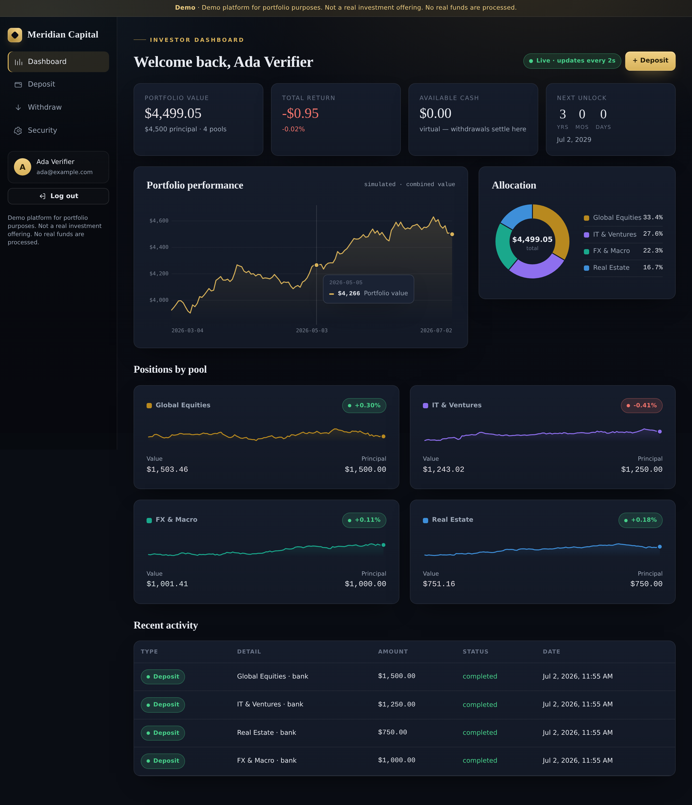
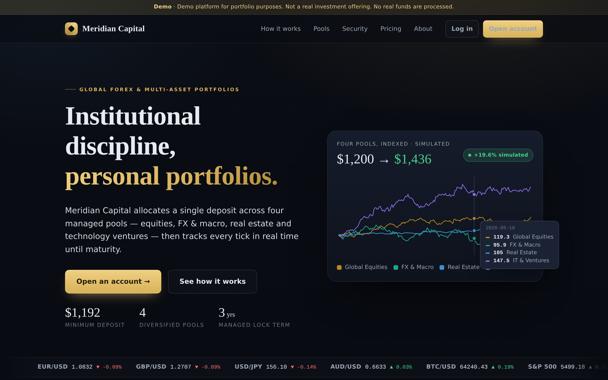
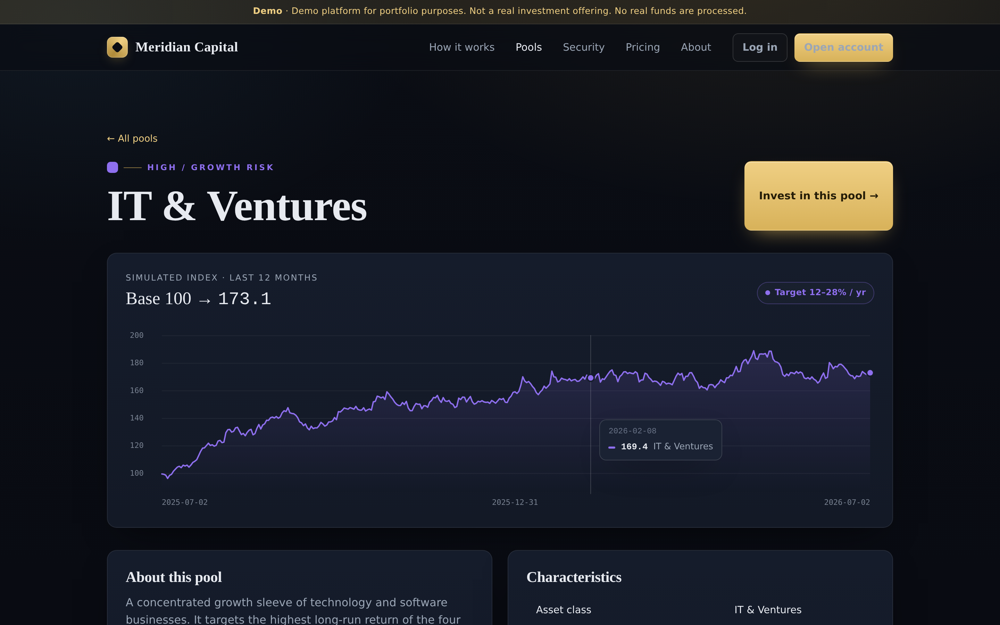

# Meridian Capital — investment/forex platform (portfolio demo)

> **Demo platform for portfolio purposes. Not a real investment offering.
> No real funds are processed.**

A polished, "global forex broker"–style marketing site, a secure,
authenticated investor portal, and a full **back-office admin console** — all
driven by a live **simulated performance engine**. Built to satisfy the spec
in [`PLAN.md`](./PLAN.md).

Every page carries the demo disclaimer. There are no real payment rails, no
custody of funds, and no real investment products. "Deposits" credit a
**virtual balance** only, and all performance is generated by a simulation.



<details>
<summary>More screenshots</summary>

**Marketing home** — four-pool simulated index with an all-series hover readout:



**Pool detail** — 12-month simulated index with crosshair tooltip and clean axis ticks:



</details>

---

## Tech stack

| Layer      | Choice                                                        |
| ---------- | ------------------------------------------------------------- |
| Runtime    | Node.js + Express (server-rendered EJS)                       |
| Database   | SQLite via `better-sqlite3` (parameterised prepared statements) |
| Auth       | bcrypt password hashing, TOTP 2FA (`speakeasy` + `qrcode`)    |
| Security   | Helmet + strict CSP, double-submit CSRF, `express-rate-limit`, secure session cookies, SQLite-backed session store |
| Charts     | Hand-written, dependency-free DPR-aware canvas charts         |
| Engine     | Geometric-Brownian-motion per-pool simulation with live ticking |

No build step, no frontend framework, no CDN dependencies — it runs offline.

## Quick start

```bash
npm install
npm run seed:demo   # create the admin + sample clients/positions (optional but recommended)
npm start           # http://localhost:3000 — schema + pool seed apply automatically
```

Useful scripts:

```bash
npm test         # unit + end-to-end HTTP tests (throwaway database)
npm run dev      # start with --watch
npm run seed     # (re)seed the four pools explicitly
npm run seed:demo # seed the admin account + a spread of demo clients with history
npm run reset    # wipe the demo DB, then re-seed pools + demo data
```

Configuration is via environment variables — see [`.env.example`](./.env.example).

### Admin console

The back-office console lives at **`/admin`** and is restricted to
administrator accounts. `npm run seed:demo` creates one and prints the login:

```
admin@meridian.demo / Admin-Demo-2026!
```

Override with `ADMIN_EMAIL` / `ADMIN_PASSWORD`. Any account whose email matches
`ADMIN_EMAIL` is promoted to admin automatically — on boot if it already
exists, or the moment it registers — so there is no self-service escalation
path. Admins also get an **Admin console** link in the investor sidebar.

The console surfaces, across the whole platform:

- **Overview** — assets under management (live curve + capital-by-pool donut),
  platform return, client/position counts, virtual cash held, pending KYC, 2FA
  adoption, active sessions, failed-login count, per-pool breakdown, money-flow
  totals, and recent signups / transactions / security events.
- **Clients** — searchable, paginated roster with KYC, 2FA, position count,
  invested value, lifetime deposits and cash; each opens a **deep view**
  (profile, KYC submission, positions, transactions, sessions, activity log)
  with KYC approve/reject, admin grant/revoke and force-logout actions.
- **Investments** — per-pool capital breakdown and a filterable ledger of every
  position across all clients.
- **Transactions** — the full money-movement ledger with flow summary and type
  filters.
- **Security** — a live security-posture panel (read from the app's own
  middleware config), all active sessions with revoke, and a filterable,
  paginated site-wide audit log.
- **KYC review** — the pending-verification queue with one-click decisions.
- **System** — runtime, performance-engine and product-terms config, plus
  per-table row counts.

Overview figures and charts refresh live via `GET /admin/api/overview`.

## Architecture

```
server.js                 # boot + start the live performance engine
src/
  config.js               # brand, terms, session, engine, security config
  app.js                  # express app: middleware, sessions, CSRF, routes
  db/
    schema.sql            # full schema (see Data model below)
    index.js  seed.js  seedDemo.js  reset.js  pools.js
  models/                 # thin repositories (prepared statements only)
    users kyc pools positions ticks transactions audit admin
  services/
    performanceEngine.js  # backfill + live GBM ticking (the core)
    portfolio.js          # derives ALL investor dashboard numbers from the tick series
    adminMetrics.js       # platform-wide AUM curve for the admin overview
    totp.js  random.js
  security/
    helmet.js csrf.js rateLimit.js validate.js auth.js sessionStore.js
  routes/
    marketing.js auth.js portal.js admin.js api.js
  utils/  money.js time.js id.js
views/                    # EJS templates (marketing/, auth/, portal/, admin/, errors/, partials/)
public/                   # css/app.css, js/app.js, js/charts.js, js/dashboard.js, js/admin.js, img/
```

### Data model (SQLite)

`users`, `kyc_submissions`, `pools`, `positions`, `performance_ticks`,
`transactions`, `sessions`, `audit_log`. Money is stored as integer **cents**.
See [`src/db/schema.sql`](./src/db/schema.sql).

### Simulated performance engine

Each pool has its own `drift_daily` / `vol_daily` (+ optional jumps): Real
Estate drifts slowly with low volatility, FX & Macro swings hardest, Global
Equities is moderate, IT & Ventures grows fastest and can jump. On deposit,
`backfillPosition()` seeds a daily track ending exactly on the principal; a
live loop then appends a fresh tick per active position every few seconds.
**Portfolio values are read from `performance_ticks` — never hardcoded.**

Live ticks are **time-scaled**: each one applies the fraction of a trading
day that actually elapsed × `SIM_SPEED` (drift scales linearly, volatility
with √t), so a long-running server compounds honestly instead of applying a
full day's return every few seconds. On boot the engine also **catches up**
any calendar days missed while the server was offline, so charts never have
flat holes.

### Charts & accessibility

The canvas charts are dependency-free and DPR-aware, with a hover layer on
every plotted chart: a crosshair that snaps to the nearest day (line charts,
with the same readout on keyboard focus + arrow keys) and per-segment
hit-testing on the allocation donut. Axis gridlines land on clean values.
The four pool accent colours were validated as a categorical palette for the
dark card surface (lightness band, chroma floor, ≥3:1 contrast, and
colour-vision-deficiency separation), and every chart pairs colour with a
text legend or table so identity never rides on colour alone.

## Security posture (of the demo itself)

Even though funds are simulated, the app is hardened: bcrypt password hashes,
CSRF tokens on every state-changing request, rate-limited auth/money routes,
a strict Content-Security-Policy (no inline or third-party scripts), secure
`httpOnly`/`sameSite` session cookies with session regeneration on login,
input validation + sanitisation, and parameterised queries throughout.

## Feature checklist (from `PLAN.md`)

**Marketing site**

- [x] Home — animated live ticker, value props, illustrative trust badges,
      per-pool performance snapshot, CTAs
- [x] How It Works — deposit → allocate → 3-year lock → real-time tracking →
      maturity, as a numbered flow
- [x] Investment Pools — overview + 4 dedicated detail pages, each with a
      simulated performance chart, risk profile and target range
- [x] Security & Trust — real app-level protections plus clearly-labelled
      illustrative custody/KYC/audit messaging
- [x] Pricing/Terms — $1,200 minimum, 3-year lock, early-withdrawal penalty
      schedule, fees
- [x] About / Legal / Contact — prominent demo disclaimer
- [x] Login / Register — entry to the portal
- [x] Demo disclaimer on **every** page (top banner + footer)

**Customer portal**

- [x] Onboarding — register → mock KYC (ID upload UI + personal info) →
      auto-approved
- [x] Deposit flow — split across pools, min $1,200 total, mock card/bank/crypto,
      simulated processing → instant virtual credit
- [x] Portfolio dashboard — **live-updating** total value, allocation donut,
      combined + per-pool charts, next-unlock countdown, transaction history
- [x] Simulated performance engine — per-pool volatility/drift, values computed
      from the tick series (never hardcoded)
- [x] Withdrawals — 3-year lock check, early-withdrawal penalty disclosure +
      explicit confirmation, penalty-free after maturity; proceeds settle in a
      **virtual cash balance** shown live on the dashboard (all simulated)
- [x] Security/account settings — password change, TOTP 2FA (real QR enrolment),
      active-sessions list with revoke, security activity log

**Admin console (`/admin`, admin-only)**

- [x] Platform overview — live AUM curve + capital-by-pool donut, return,
      client/position counts, cash held, pending KYC, 2FA adoption, active
      sessions, failed logins, money-flow totals, recent-activity feeds
- [x] Clients — searchable/paginated roster + per-client deep view
- [x] Client actions — KYC approve/reject, admin grant/revoke, force-logout
- [x] Investments — per-pool capital breakdown + all-positions ledger
- [x] Transactions — site-wide money-movement ledger with filters
- [x] Security — live posture panel, all sessions with revoke, audit log
- [x] KYC review queue with one-click decisions
- [x] System — runtime/engine/terms config + per-table row counts
- [x] Access control — admin bootstrap by email, `requireAdmin` guard,
      CSRF on every action

**Security hygiene of the demo itself**

- [x] bcrypt password hashing · [x] CSRF protection · [x] rate-limited auth
- [x] input validation/sanitisation · [x] parameterised queries · [x] strict CSP
- [x] secure `httpOnly`/`sameSite` session cookies · [x] session regeneration on login

## Testing

`npm test` runs two suites on throwaway databases (nothing touches your data):

- **`test/unit.test.js`** — money/cents math, validation and password policy,
  date/anniversary logic, deterministic PRNG + gaussian statistics, engine
  backfill/tick/catch-up behaviour (including √t step scaling), portfolio
  snapshot math, penalty tiers and the virtual cash ledger.
- **`test/integration.test.js`** — boots the real app on an ephemeral port and
  drives the full journey over HTTP: disclaimer on every page, CSRF rejection,
  registration validation, KYC gating (minors rejected), deposit min/max
  rules and zero-skip, backfilled live portfolio API, early withdrawal
  (confirmation + penalty + cash credit), password change, full TOTP 2FA
  enrolment and challenged login, active sessions and the audit log.
- **`test/admin.test.js`** — seeds a demo dataset and exercises the admin
  console over HTTP: access control (anonymous → login, non-admin → 403,
  admin → 200), every console page, the live overview JSON, client search +
  deep view, a KYC approval action (DB state verified) and CSRF enforcement.

## Verification

Run the flow from `PLAN.md`:

1. `npm install && npm start`, open http://localhost:3000
2. Register → complete mock KYC (auto-approved)
3. Deposit $1,200+ split across pools → dashboard shows a live portfolio
4. Watch the portfolio value tick (values come from `performance_ticks`)
5. Try an early withdrawal → penalty/lock warning + confirmation required;
   the net amount lands in your virtual cash balance
6. Confirm the demo disclaimer appears on every page
